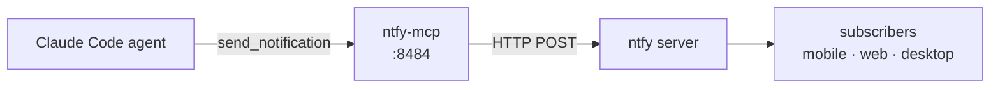

# ntfy-mcp

[](https://claude.ai/code)
[](https://github.com/TadMSTR/ntfy-mcp/actions/workflows/ci.yml)

MCP server for sending push notifications via [ntfy](https://ntfy.sh). One tool, no database, stateless — it's an HTTP proxy between Claude and your ntfy instance.

I added this because every automated workflow on claudebox already uses ntfy for push notifications (memory pipeline completions, backup results, resource alerts), but agents had to go through a shell-access MCP or write raw curl to send them. This gives every Claude Code session a native `send_notification` tool call instead.



## Tool

### `send_notification`

```
send_notification(
    message,
    topic?,
    title?,
    priority?,
    tags?,
    markdown?,
    click?,
    icon?
)
```

| Parameter | Type | Default | Description |
|-----------|------|---------|-------------|
| `message` | string | required | Notification body. Supports Markdown if `markdown=true`. |
| `topic` | string | `NTFY_DEFAULT_TOPIC` | ntfy topic to publish to. |
| `title` | string | — | Bold title shown above the message. |
| `priority` | string | `default` | `min` \| `low` \| `default` \| `high` \| `urgent` (alias: `max`) |
| `tags` | list[str] | — | Emoji short codes or plain tags, e.g. `["white_check_mark", "claudebox"]`. See the [ntfy emoji list](https://docs.ntfy.sh/emojis/). |
| `markdown` | bool | `false` | Enable Markdown rendering in the notification body. |
| `click` | string | — | URL to open when the notification is tapped. |
| `icon` | string | — | URL of an icon image to display with the notification. |

Returns `{"ok": true, "topic": "...", "status": 200}` on success, or `{"ok": false, "error": "..."}` on failure.

## Setup

### Docker

No external dependencies — the container only needs outbound HTTP access to your ntfy instance.

```yaml
services:
  ntfy-mcp:
    build:
      context: /path/to/ntfy-mcp
      dockerfile: Dockerfile
    container_name: ntfy-mcp
    ports:
      - "8484:8484"
    environment:
      - NTFY_URL=https://ntfy.yourdomain.com
      - NTFY_DEFAULT_TOPIC=claudebox
      - NTFY_TOKEN=          # leave empty for open instances
      - MCP_PORT=8484
    networks:
      - claudebox-net
    restart: unless-stopped

networks:
  claudebox-net:
    external: true
```

```bash
cd /path/to/docker/ntfy-mcp
docker compose up -d
docker logs ntfy-mcp --tail 10
```

The container logs should show `Uvicorn running on http://0.0.0.0:8484`.

### Claude Code

Add to `~/.claude/settings.json` under `mcpServers`:

```json
{
  "mcpServers": {
    "ntfy": {
      "type": "streamable-http",
      "url": "http://localhost:8484/mcp"
    }
  }
}
```

### LibreChat

Add to `librechat.yaml` under `mcpServers`:

```yaml
mcpServers:
  ntfy:
    type: streamable-http
    url: http://host.docker.internal:8484/mcp
```

Note the difference: Claude Code uses `localhost`; LibreChat containers reach the host via `host.docker.internal`.

## Environment Variables

| Variable | Default | Description |
|----------|---------|-------------|
| `NTFY_URL` | `https://ntfy.sh` | Base URL of your ntfy instance |
| `NTFY_DEFAULT_TOPIC` | `claudebox` | Topic used when `topic` is not passed to the tool |
| `NTFY_TOKEN` | (empty) | Bearer token for authenticated instances. Leave empty for open instances. |
| `MCP_PORT` | `8484` | Port the MCP server listens on |

Copy `.env.example` to `.env` and fill in the values you need. Blank values use the defaults shown above.

## Testing

```bash
pip install -r requirements.txt -r requirements-dev.txt
pytest -v
```

Nine tests covering header construction, priority validation, default topic fallback, HTTP error handling, and bearer token injection.

## Gotchas

**Topic values containing `/` or `..` are rejected.** The handler returns `{"ok": false, "error": "Invalid topic: ..."}` for any topic that would alter the URL path. Topics must be plain strings with no path separators.

**Open vs authenticated instances.** If `NTFY_TOKEN` is empty, no `Authorization` header is sent. If your ntfy instance requires auth and the token is missing or wrong, you'll get a 401 back as `{"ok": false, "status": 401, "error": "..."}`.

**Port 8484 is the default.** Adjust if you have a conflict — set `MCP_PORT` in the environment and update the `ports` binding in the compose file to match.

## Standalone Value

High. If you're already running ntfy for push notifications, this is a 10-minute integration that makes every Claude agent a first-class notification sender. No dependencies, no state, nothing to maintain.
